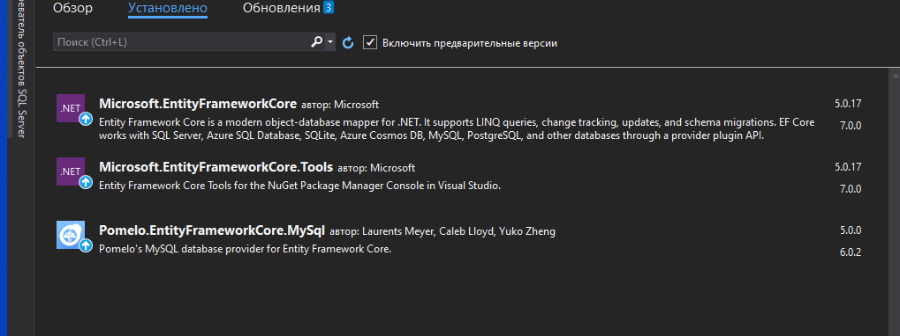
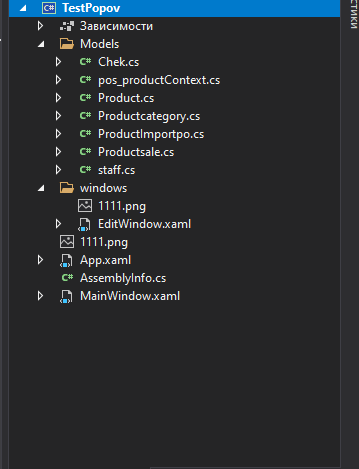
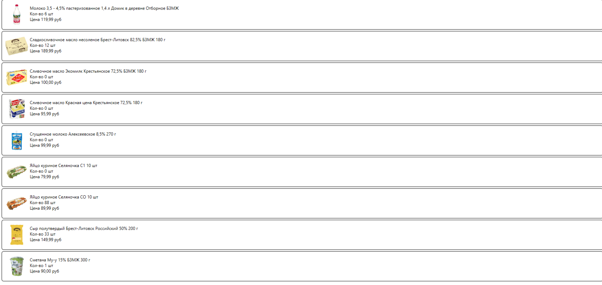

<table style="width: 100%;">
  <tr>
    <td style="text-align: center; border: none;">
    Министерство образования и науки РФ<br>
Государственное бюджетное профессиональное образовательное учреждение Республики Марий Эл<br>
Йошкар-Олинский технологический колледж
</td>
  </tr>
  <tr>
    <td style="text-align: center; border: none; height: 15em;">
    
 <h2 style="font-size:3em;">    <br> Разработка desktop-приложения на .NET Core<br><br> <b> </b></h2> </h3></td>
  </tr>
  <tr>
    <br><br><td style="text-align: right; border: none; height: 20em;">
      Разработал: <br/>
      Попов Илья
      Группа: И-41<br>
     
   
  </tr>
  <tr>
    <td style="text-align: center; border: none; height: 5em;">
    г.Йошкар-Ола,<br> 2022</td>
  </tr>
</table>

# Оглавление


1.[Создание проекта на .Net Core](#создание-проекта-на-net-core)

2.[Создание подключения к бд MySQL](#создание-подключения-к-бд-mysql)

3.[Получение данных с сервера.Вывод в Listview](#получение-данных-с-сервера)

4.[Поиск](#поиск)

5.[Сортировка](#сортировка)

6.[Фильтрация](#фильтрация)

7.[Пагинация](#пагинация)

8.[Создание и редактирование продукции](#создание-и-редактирование-продукции)

9.[Сравнение кода проектов на Net.Framework и Net.Core](#сравнение-кода-проектов-на-netframework-и-netcore)
# Создание проекта на .Net Core
### 1) Создайте проект 


### 2) В контекстном меню зависимости выберите "Управление пакетами NuGet" и установите пакеты "Microsoft.EntityFrameworkCore", "Microsoft.EntityFrameworkCore.Tools" и "Pomelo.EntityFrameworkCore.MySql"(версии 5.0)


# Создание подключения к бд MySQL
###  1) Создайте папку Models
### 2) В Visual Studio напишите в поиск : Консоль диспетчера пакетов. И выполните в ней команду (вписав свою базу и пароль):
```cs
Scaffold-DbContext "server=server232;database=ваша база;uid=serv232;password=123456;" Pomelo.EntityFrameworkCore.MySql -OutputDir Models -f
```
### После удачного выполнения программы в папка models должна заполниться


**context.Products это не модель, а виртуальный DbSet (коллекция сущностей), объявленный в классе контекста: public virtual DbSet<Product> Products { get; set; }.**
# Получение данных с сервера
## В главном окне(в конструкторе) мы получаем список продукции
```
using (var context = new pos_productContext())
            {
                ProductList = context.Products.ToList();
                
            }
```
```cs
public partial class MainWindow : Window
{
 public IEnumerable<Product> ProductList { get; set; }
 public MainWindow()
        {
            InitializeComponent();
            DataContext = this;
            //pos_productContext-это мой класс подключения бд(виртуальный DbSet (коллекция сущностей))
            using (var context = new pos_productContext())
            {
                ProductList = context.Products.ToList();
                
            }
        }
}
```
# Разметка главного окна
 ```xml
<Grid ShowGridLines="True">
        <Grid.RowDefinitions>
            <RowDefinition Height="auto"/>
            <RowDefinition />
            <RowDefinition Height="auto"/>
        </Grid.RowDefinitions>
        <Grid.ColumnDefinitions>
            <ColumnDefinition Width="200"/>
            <ColumnDefinition/>
        </Grid.ColumnDefinitions>

        <StackPanel 
        Orientation="Vertical"
        Grid.RowSpan="3"
        VerticalAlignment="Bottom">
            <!-- левая панель для кнопок -->
        </StackPanel>

        <WrapPanel
        Orientation="Horizontal"
        Grid.Column="1"
        MinHeight="50">
           
        </WrapPanel>

        <ListView
            x:Name="Listview"
    Grid.Row="1"
    Grid.Column="1"

    ItemsSource="{Binding ProductList}"
>
            <ListView.ItemContainerStyle>
                <Style 
            TargetType="ListViewItem">
                    <Setter 
                Property="HorizontalContentAlignment"
                Value="Stretch" />
                </Style>
            </ListView.ItemContainerStyle>

            <ListView.ItemTemplate>
                <DataTemplate>
                    <Border 
            BorderThickness="1" 
            BorderBrush="Black" 
            CornerRadius="5">

                        <Grid 
    Margin="10" 
    HorizontalAlignment="Stretch">

                            <Grid.ColumnDefinitions>
                                <ColumnDefinition Width="64"/>
                                <ColumnDefinition Width="*"/>
                                <ColumnDefinition Width="auto"/>
                            </Grid.ColumnDefinitions>

                            <Image
    Width="64" 
    Height="64"
    Source="{Binding ImagePreview}" />
                            <StackPanel
    Grid.Column="1"
    Margin="5"
    Orientation="Vertical">

                                <TextBlock 
        Text="{Binding Title}"/>

                                <TextBlock 
        Text="{Binding quantity}"/>

                                <TextBlock 
        Text="{Binding price}"/>
                            </StackPanel>
                        </Grid>

                    </Border>
                </DataTemplate>
            </ListView.ItemTemplate>
        </ListView>
      
    </Grid>
```
## В итоге дожно получиться следующее:


# Поиск
 1) В разметке в панель элементов управления (WrapPanel) добавляем текстовое поле для ввода строки поиска
 ```xml
<TextBox
    Width="200"
    VerticalAlignment="Center"
    x:Name="SearchFilterTextBox" 
    KeyUp="SearchFilterTextBox_KeyUp"/>

```
2) В коде окна запоминаем вводимую строку
```cs
private string SearchFilter="";
private void SearchFilterTextBox_KeyUp(object sender, KeyEventArgs e)
{
    SearchFilter = SearchFilterTextBox.Text;
    Invalidate();
}
```
 3) Создаем геттер списка продукции
```cs
 private IEnumerable<Product> _ProductList;

        public IEnumerable<Product> ProductList
        {
            get
            {
                var Result = _ProductList;

               
                if (SearchFilter != "")
                    Result = Result.Where(
                        p => p.Title.IndexOf(SearchFilter, StringComparison.OrdinalIgnoreCase) >= 0 ||
                                p.Description?.IndexOf(SearchFilter, StringComparison.OrdinalIgnoreCase) >= 0
                    );

              
                return Result;
            }
            set
            {
                _ProductList = value;
                Invalidate();
            }
        }

```
 А также устраняем ошибку,закометив  
```cs 
// public IEnumerable<Product> ProductList { get; set; } 
``` 
 4) Реализуем интерфейс INotifyPropertyChanged ,для обновления списка продукции и сам метод Invalidate()
```cs
 public partial class MainWindow : Window,INotifyPropertyChanged

```
```cs
 private void Invalidate(string ComponentName = "ProductList")
        {
            if (PropertyChanged != null)
                PropertyChanged(
                    this,
                    new PropertyChangedEventArgs(ComponentName));
        }
```


# Сортировка
1) Создаем массив со списком типов сортировок
```cs
public string[] SortList { get; set; } = {
    "Без сортировки",
    "название по убыванию",
    "название по возрастанию",
    "номер цеха по убыванию",
    "номер цеха по возрастанию",
    "цена по убыванию",
    "цена по возрастанию" };
```
2) В разметку  добавляем выпадающий список (ComboBox)

 ```xml
    
    <ComboBox
        Name="SortTypeComboBox"
        SelectedIndex="0"
        VerticalContentAlignment="Center"
        MinWidth="200"
        SelectionChanged="SortTypeComboBox_SelectionChanged"
        ItemsSource="{Binding SortList}"/>
 ```  

 3) Реализуем обработчик выбора из списка

 Запоминаем ИНДЕКС выбранного элемента
```CS
private int SortType = 0;

private void SortTypeComboBox_SelectionChanged(object sender, SelectionChangedEventArgs e)
{
    SortType = SortTypeComboBox.SelectedIndex;
    Invalidate();
}
```

4) И дорабатываем геттер списка продукции
```CS
get {
    var Result = _ProductList;

    switch (SortType)
    {
        // сортировка по названию продукции
        case 1:
            Result = Result.OrderBy(p => p.Title);
            break;
        case 2:
            Result = Result.OrderByDescending(p => p.Title);
            break;
        
    }

    
    return Result;
} 
```
# Фильтрация
Список типов продукции мы можем получить из базы данных.

1. Создаем список продукции, заполняем его данными из базы (в конструкторе главного окна, там же где получали список продукции) и добавляем в начало пункт "Все типы продукции"

    ```cs
    public List<ProductType> ProductTypeList { get; set; }

    ...

    ProductTypeList = context.ProductTypes.ToList();
    ProductTypeList.Insert(0, new ProductType { Title = "Все типы продукции" });
    ```

2. В разметке в панель элементов управления (WrapPanel) добавляем выпадающий список

    ```xml
    <ComboBox
        Width="150"
        x:Name="ProductTypeFilter"
        SelectedIndex="0"
        SelectionChanged="ProductTypeFilter_SelectionChanged"
        ItemsSource="{Binding ProductTypeList}">
    </ComboBox>
    ```


    Для преобразования объекта в строку есть метод *Object.ToString()*, и так как все объекты являются потомками класса **Object**, то нам достаточно в модели **ProductType** перегрузить это метод:

    ```cs
    public override string ToString() {
        return Title;
    }
    ```

3. Реализуем обработчик выбора элемента фильтра    

    ```cs
    private int ProductTypeFilterId = 0;

    private void ProductTypeFilter_SelectionChanged(object sender, SelectionChangedEventArgs e)
    {
        // запоминаем ID выбранного типа
        ProductTypeFilterId = (ProductTypeFilter.SelectedItem as ProductType).ID;
        Invalidate();
    }
    ```

4. И опять дорабатываем геттер списка продукции

    ```cs
    ...
    var Result = _ProductList;

    // действия, которые уменьшают размер выборки помещаем вверх
    if (ProductTypeFilterId > 0)
        Result = Result.Where(
            p => p.ProductTypeID == ProductTypeFilterId);

    switch (SortType)
    
    ```
 
 # Пагинация
```xml
//Создаем в нижней панели WrapPanel и кидаем 5 или 4 Label и обрабатываем клик на них
//(&lt; -это < )(&gt;- это >)
<WrapPanel  Grid.Row="2"HorizontalAlignment="Right" Width="149"  Grid.Column="1">
            <Label Content="&lt;" FontFamily=" Century Gothic" FontSize="20" MouseDown="Label_MouseDown"/>

            <Label Content="1" FontFamily=" Century Gothic" FontSize="20" MouseDown="Label_MouseDown_1"/>

            <Label Content="2" FontFamily=" Century Gothic" FontSize="20" MouseDown="Label_MouseDown_2"/>

            <Label Content="3" FontFamily=" Century Gothic" FontSize="20" MouseDown="Label_MouseDown_3"/>
            <Label Content="4" FontFamily=" Century Gothic" FontSize="20" MouseDown="Label_MouseDown_4"/>

            <Label Content="&gt;" FontFamily=" Century Gothic" FontSize="20" MouseDown="Label_MouseDown_5"/>
        </WrapPanel>

```
### Заводим переменую  CurrentPage 
```cs 
 public int CurrentPage = 1;
```
### Обрабатываем клики по кнопке
```cs
  private void Label_MouseDown(object sender, MouseButtonEventArgs e)
        {
            if (CurrentPage > 1)
            {
                CurrentPage--;
                Invalidate();
            }
        }

        private void Label_MouseDown_1(object sender, MouseButtonEventArgs e)
        {
            CurrentPage = 1;
            Invalidate();
        }

        private void Label_MouseDown_2(object sender, MouseButtonEventArgs e)
        {
            CurrentPage = 2;
            Invalidate();
        }

        private void Label_MouseDown_3(object sender, MouseButtonEventArgs e)
        {
            CurrentPage = 3;
            Invalidate();
        }

        private void Label_MouseDown_4(object sender, MouseButtonEventArgs e)
        {
            CurrentPage = 4;
            Invalidate();
        }

        private void Label_MouseDown_5(object sender, MouseButtonEventArgs e)
        {
            CurrentPage++;
            Invalidate();
        }
```
### И в гетере добавляем 
 ```cs
 //у меня по 15 страниц
 return Result.Skip((CurrentPage - 1) * 15).Take(15);
 ```

# Создание и редактирование продукции


1. Создайте новое окно: **EditProductWindow** (в папке **Windows** )

1. В классе окна **EditProductWindow** добавьте свойство *CurrentProduct*, в котором будет храниться добавляемый/редактируемый экземпляр продукции:

    ```cs
    public Product CurrentProduct { get; set; }
    ```

    И геттер для названия окна:

    ```cs
    public string WindowName {
        get {
            return CurrentProduct.Id == 0 ? "Новый продукт" : "Редактирование продукта";
        }
    }
    ```
1. В конструктор окна добавьте параметр типа **Product** и присвойте его ранее объявленному свойству:

    ```cs
    public EditWindow(Product EditProduct)
    {
        InitializeComponent();
        DataContext = this;
        CurrentProduct = EditProduct;
    }
    ```

1. В разметке окна вместо фиксированного названия вставьте привязку к свойству *WindowName*

    ```xml
    <Window
        ...
        Title="{Binding WindowName}">
    ```

1. В окне редактирования продукции создайте сетку из трёх колонок: в первой у нас будет изображение, во второй редактируемые поля продукта, а в третей список материалов

    ```xml
    <Grid.ColumnDefinitions>
        <ColumnDefinition Width="auto"/>
        <ColumnDefinition Width="*"/>
        <ColumnDefinition Width="auto"/>
    </Grid.ColumnDefinitions>
    ```

1. Во вторую колонку добавьте **StackPanel** с границами (чтобы визуальные компоненты не прилипали к границам окна) и в этом списке разместите редактируемые элементы

   

    ```xml
    <StackPanel
        Grid.Column="1" 
        Margin="5">

     
            <Label Content="Наименование продукта"/>
            <TextBox Text="{Binding CurrentProduct.Title}"/>

            <Label Content="Количество"/>
            <TextBox Text="{Binding CurrentProduct.Quantity}"/>
            <Label Content="Описание"/>
            <TextBox AcceptsReturn="True" Height="2 cm" Text="{Binding CurrentProduct.Description}"/>
            <Label Content="Цена"/>
            <TextBox Text="{Binding CurrentProduct.Price}"/>
            <Label Content="Категория"/>
            <ComboBox 
    ItemsSource="{Binding ProductTypeList}"
    SelectedItem="{Binding CurrentProduct.ProductCategory}"/>

    </StackPanel>
    ```

  

    * Выбор типа продукта из списка

        В классе окна объявляем свойство *ProductTypes* - список типов продукции

        ```cs
        public IEnumerable<ProductType> ProductTypeList { get; set; }
        ```

        И в конструкторе получаем его из контекста БД:

        ```cs
        using (var context = new pos_productContext())
        {
            ProductTypeList = context.ProductTypes.ToList();
        }        
        ```

        В вёрстке окна редактирования продукции мы можем использовать выпадающий список, атрибут *SelectedItem* которого позволяет отобразить текущее значение редактируемого элемента

        ```xml
        <ComboBox 
            ItemsSource="{Binding ProductTypeList}"
            SelectedItem="{Binding CurrentProduct.ProductType}"/>
        ```

         Переопределите метод **Equals** у класса **ProductType**:

        ```cs
        public override bool Equals(object obj)
        {
            return (obj != null) && 
                (obj is ProductType) && 
                (this.Id == (obj as ProductType).Id);
        
        }
        ```

        Здесь мы проверяем определён ли вообще объект (у нового продукта его ещё нет), нужного ли он типа и совпадет ли его **Id** с **Id** текущего типа продукции 

    * смена изображения продукции

        Вывод изображения производится как и в главном окне

        ```xml
        <Image
            Width="200" 
            Height="200"
            Source="{Binding CurrentProduct.ImagePreview,TargetNullValue={StaticResource defaultImage}}" />
        ```

        
        Обработчик кнопки:

        ```cs
        private void ChangeImage_Click(object sender, RoutedEventArgs e)
        {
           OpenFileDialog GetImageDialog = new OpenFileDialog();
            GetImageDialog.Filter = "Файлы изображений: (*.png, *.jpg)|*.png;*.jpg";
            GetImageDialog.InitialDirectory = Environment.CurrentDirectory;
            if (GetImageDialog.ShowDialog() == true)
            {
                image.Source = new BitmapImage(new Uri(GetImageDialog.FileName));
                CurrentProduct.Image = GetImageDialog.FileName.Substring(Environment.CurrentDirectory.Length);
                Invalidate();
            }
        }
        ```

    * Многострочное описание

        Тут просто - разрешаем переносы и задаем высоту элемента

        ```xml
        <Label Content="Описание продукта"/>
        <TextBox 
            AcceptsReturn="True"
            Height="2cm"
            Text="{Binding CurrentProduct.Description}"/>
        ```

1. Сохранение введенных данных

    В разметку добавьте кнопку **Сохранить** и напишите обработчик

    ```cs
    private void Button_Click(object sender, RoutedEventArgs e)
    {
         using(var context= new pos_productContext())
            {
                try
                {
                    Product product = null;
                    if (CurrentProduct.Id != 0)
                        product = context.Products.Find(CurrentProduct.Id);
                    else
                        product = new Product();

                    if (product != null)
                    {
                        // сюда добавлять проверки

                        product.Title = CurrentProduct.Title;
                        product.Quantity = CurrentProduct.Quantity;
                        product.Description = CurrentProduct.Description;
                        product.ProductCategoryId = CurrentProduct.ProductCategory.Id;
                        product.Price = CurrentProduct.Price;
                        product.Image = CurrentProduct.Image;

                        if (product.Id == 0)
                            context.Products.Add(product);
                        else
                            context.Products.Update(product);

                        if (context.SaveChanges() > 0)
                        {
                            DialogResult = true;
                        }
                    }
                }
                catch (Exception ex)
                {

                    if (ex.InnerException != null)
                        MessageBox.Show(ex.InnerException.Message);
                    else
                        MessageBox.Show(ex.Message);
                }
            }  
    }
    ```

1. Открытие окна редактирования для существующей и новой продукции

    * для редактирования существующей продукции в списке продукции реализуем обработчик двойного клика

        ```cs
         private void ListView_MouseDoubleClick(object sender, MouseButtonEventArgs e)
        {

            // в создаваемое окно передаем выбранный продукт
            var NewEditWindow = new windows.EditWindow(Listview.SelectedItem as Product);
            if ((bool)NewEditWindow.ShowDialog())
            {
                // при успешном сохранении продукта перечитываем список продукции
                using (var context = new pos_productContext())
                {
                    ProductList = context.Products
                        //ProductCategory -это у меня ProductTypes
                        .Include(product => product.ProductCategory)
                        .ToList();
                    Invalidate();
                }
            }
        }
        ```

    * для создания нового продукта в разметке главного окна создайте кнопку "Добавить продукцию" (в левой панели) и в её обработчике создайте новый экземпляр продукта

```cs
        var NewEditWindow = new windows.EditWindow(new Product());
            if ((bool)NewEditWindow.ShowDialog())
            {
                using (var context = new pos_productContext())
                {
                    ProductList = context.Products.ToList();
                    Invalidate();
                }

            }
 ```
 # Сравнение кода проектов на Net.Framework и Net.Core
 **1) Создание подключения к бд Mysql на Net.Framework**
 ```cs
 class MySQLDataProvider:IDataProvider
    {
        private MySqlConnection connection;
        public MySQLDataProvider()
        {
            try
            {
                connection = new MySqlConnection("Server=server232;port=3306;database=pos_product;UserId=serv232;password=123456;");
            }
            catch (Exception ex)
            {

                MessageBox.Show(ex.Message);
            }
        }
 ```
**1) Создание подключения к бд Mysql на Net.Core**
 ```cs
Scaffold-DbContext "server=server232;database=ваша база;uid=serv232;password=123456;" Pomelo.EntityFrameworkCore.MySql -OutputDir Models -f
```
**2) Получение данных с сервера на Net.Framework**
```cs
  public  class Product
    {
        public int id { get; set; }
        public Category CategoryType { get; set; }
        public int Quantity { get; set; }
        public decimal Price { get; set; }
        public string Image { get; set; }
        public string Title { get; set; }
        public string Description { get; set; }
    }
 ```
 ```cs
     interface IDataProvider
    {
        IEnumerable<Product> GetProducts();
    }
```
```cs
     public IEnumerable<Product> GetProducts()
        {
            GetCategories();
            connection.Open();
    
            List<Product> ProductList = new List<Product>();
            string Query = @"SELECT * ,pt.Title As ProductTitle
                            FROM pos_product.product,pos_product.productcategory pt
                            Where pos_product.product.ProductCategory_id=pt.id";

            MySqlCommand Command = new MySqlCommand(Query, connection);
            MySqlDataReader Reader = Command.ExecuteReader();
            while (Reader.Read())
            {
                Product NewProduct = new Product();
                NewProduct.id = Reader.GetInt32("id");
                NewProduct.Image = Reader.GetString("Image");
                NewProduct.Title = Reader.GetString("Title");
                NewProduct.Price = Reader.GetDecimal("Price");
                NewProduct.Description = Reader.GetString("Description");
                NewProduct.Quantity = Reader.GetInt32("Quantity");
                NewProduct.CategoryType = GetCategory(Reader.GetInt32("ProductCategory_id"));
                ProductList.Add(NewProduct);

            }

            connection.Close();

            return ProductList;
        }
```
**2) Получение данных с сервера на Net.Core**
```cs
public List<Product> ProductList { get; set; }
 public MainWindow()
        {
            InitializeComponent();
            DataContext = this;
            Globals.DataProvider = new MySQLDataProvider();
            ProductList = (List<Product>)Globals.DataProvider.GetProducts();
        }
```
**3) Добавление и редактирование продукции на Net.Framework**
```cs
interface IDataProvider
    {
        void SaveTovar(Product currentProduct);
  
    }
```
```cs
 public void SaveTovar(Product currentProduct)
        {

            connection.Open();
            try
            {
                if (currentProduct.id == 0)
                {

                    string Query = @"INSERT INTO product
                                    (
                                    Title,
                                    Quantity,
                                    Description,
                                    Price,
                                    Image,
                                    ProductCategory_id)
                                    VALUES
                                    (@Title,
                                    @Quantity,
                                    @Description,
                                    @Price,
                                    @Image,
                                    @ProductCategory_id)";
                    MySqlCommand Command = new MySqlCommand(Query, connection);
                    Command.Parameters.AddWithValue("Title", currentProduct.Title);
                    Command.Parameters.AddWithValue("Quantity", currentProduct.Quantity);
                    Command.Parameters.AddWithValue("Description", currentProduct.Description);
                    Command.Parameters.AddWithValue("Price", currentProduct.Price);
                    Command.Parameters.AddWithValue("Image", currentProduct.Image);
                    Command.Parameters.AddWithValue("ProductCategory_id", currentProduct.CategoryType.id);
                    Command.ExecuteNonQuery();
                }

                else
                {
                    string Query = @"
UPDATE product
SET

Title = @Title,
Quantity =@Quantity,
Description = @Description,
Price = @Price,
Image = @Image,
ProductCategory_id = @ProductCategory_id
WHERE id = @id;
";
                    MySqlCommand Command = new MySqlCommand(Query, connection);
                    Command.Parameters.AddWithValue("Title", currentProduct.Title);
                    Command.Parameters.AddWithValue("Quantity", currentProduct.Quantity);
                    Command.Parameters.AddWithValue("Description", currentProduct.Description);
                    Command.Parameters.AddWithValue("Price", currentProduct.Price);
                    Command.Parameters.AddWithValue("Image", currentProduct.Image);
                    Command.Parameters.AddWithValue("ProductCategory_id", currentProduct.CategoryType.id);
                    Command.Parameters.AddWithValue("id", currentProduct.id);
                    Command.ExecuteNonQuery();
                }
            }

            catch (Exception ex)
            {

                MessageBox.Show(ex.Message);
            }
            finally
            {
                connection.Close();
            }
        }
```
```cs
              try
                {

                    Globals.DataProvider.SaveTovar(CurrentProduct);
                    DialogResult = true;
                    
                }
                catch (Exception ex)
                {

                     MessageBox.Show(ex.Message);
                }
```

**3) Добавление и редактирование продукции на Net.Core**
```cs
 private void AddBtn_Click(object sender, RoutedEventArgs e)
        {
            using(var context= new pos_productContext())
            {
                try
                {
                    Product product = null;
                    if (CurrentProduct.Id != 0)
                        product = context.Products.Find(CurrentProduct.Id);
                    else
                        product = new Product();

                    if (product != null)
                    {


                        product.Title = CurrentProduct.Title;
                        product.Quantity = CurrentProduct.Quantity;
                        product.Description = CurrentProduct.Description;
                        product.ProductCategoryId = CurrentProduct.ProductCategory.Id;
                        product.Price = CurrentProduct.Price;
                        product.Image = CurrentProduct.Image;

                        if (product.Id == 0)
                            context.Products.Add(product);
                        else
                            context.Products.Update(product);

                        if (context.SaveChanges() > 0)
                        {
                            DialogResult = true;
                        }
                    }
                }
                catch (Exception ex)
                {

                    if (ex.InnerException != null)
                        MessageBox.Show(ex.InnerException.Message);
                    else
                        MessageBox.Show(ex.Message);
                }
            }
        }

```

        


 
